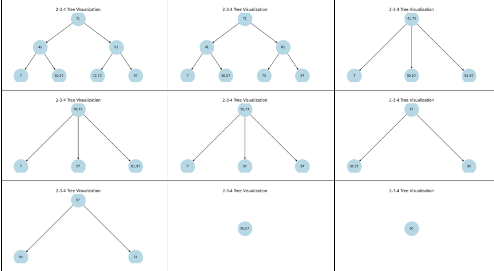

#Group Members: Michael Jung (ID:10680322), Timothy Sanders (ID: 01002147), Megan Ng (ID: 00756276)

#Date: 6/02/25

#Course: Spr25_CS_034 CRN 39575

🌳 Lab 15 – Balanced Trees in Action: Two-Track Options
📌 Join LAB15 Group – Required for All
Even if you plan to work individually, you must join the LAB 15 group before you start.

🗓 Due Date: Sunday, June 8
This week, you’ll choose one of two lab tracks designed to deepen your understanding of B-Trees and 2-3-4 Trees through hands-on Java development and structured problem-solving.

🔧 Option 1: Reflect, Refactor, and Rebuild
Revisit a previous lab or Java project and take it to the next level. Select one that you can:

✅ Improve using balanced tree logic

✅ Extend with features inspired by B-Trees or 2-3-4 Trees

✅ Refactor for better readability, scalability, or design clarity

This is your chance to demonstrate your growth as a developer by refining your earlier work using new techniques.

📤 Submission Requirements


🧾 Grading Rubric – Option 1
Category	Points
Refactoring Quality	10 pts
Balanced Tree Enhancements	10 pts
Code Clarity & Documentation	5 pts
README Explanation	5 pts
Total	30 pts
🧪 Option 2: Build a B-Tree from Scratch in Java
Create a simplified B-Tree or 2-3-4 Tree class with core functionalities and balancing logic.

🔨 Required Methods
insert(int key) – Add a new key to the tree

contains(int key) – Check whether a key exists

inOrderTraversal() – Print all keys in sorted order

remove(int key) – (Bonus) Delete a key and rebalance if necessary

📋 Technical Requirements
Implement a 2-3-4 node structure with dynamic node splitting

Each node should support up to 3 keys

Nodes can have between 2 and 4 children

💡 Implementation Tips
Start with a Node class to hold keys and children

Use a test driver to insert 15–20 random integers

Print in-order results to validate the structure

⭐ Extra Credit
Add a visual print method that shows the tree level by level

📤 Submission Requirements
Submit your code files, output screenshots, and a short README through zyBooks

Ensure your code is commented, especially around node splitting logic

### Sample Output
```
Inserted 10
     [10]

Inserted 20
   [10, 20]

Inserted 5
  [5, 10, 20]

Inserted 6
              [10]
          [5, 6]  [20]

Inserted 12
              [10]
        [5, 6]  [12, 20]

Inserted 30
              [10]
      [5, 6]  [12, 20, 30]

Inserted 25
                             [10, 20]
               [5, 6]  [12]  [25, 30]  [12, 20, 30]

In-Order Traversal:
[5, 6, 10, 12, 20, 25, 30]
```


🧾 Grading Rubric – Option 2
Category	Points
Core Tree Methods Functionality	10 pts
Balancing Logic & Node Splits	10 pts
Code Quality & Comments	5 pts
Output Demonstration & README	5 pts
Total	30 pts
💬 Support & Collaboration
You may work independently or with one partner (submit individually)

Visit Zoom office hours or post in the DQ: Questions thread if you need help

Let us know which track you choose—and give it your best effort. You’ve got this!
