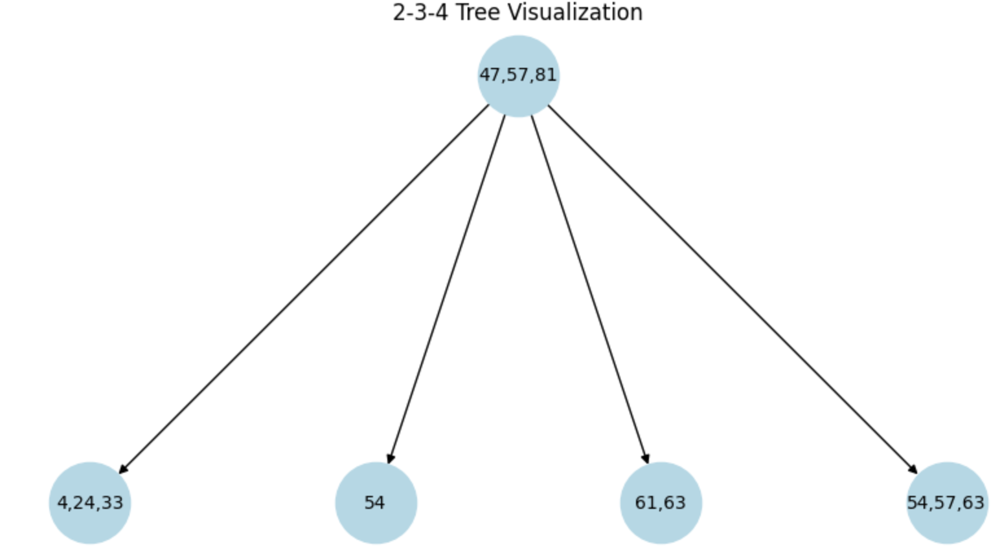
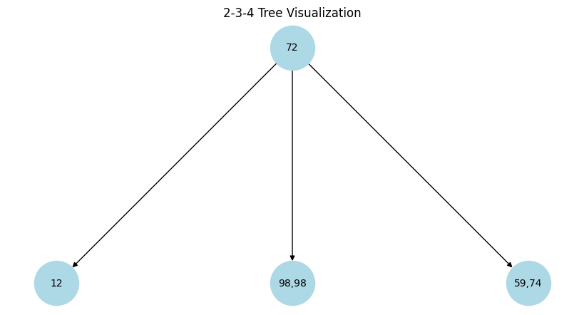

💬 Collaboration Group Members: Michael Jung (ID:10680322), Timothy Sanders (ID: 01002147), Megan Ng (ID: 00756276)

🗓 Date: 6/03/25

📌 Course: Spr25_CS_034 CRN 39575

# 🌳 Lab 15 – Balanced Trees in Action: Two-Track Options

🔧 Option 1: Reflect, Refactor, and Rebuild

## 🧪 Option 2: Build a B-Tree from Scratch in Python

- Create a 2-3-4 Tree node structure
  
       - Each node support up to 3 keys
       - Each node has 1, 2 or 3 children
- Implement a 2-3-4 Tree structure with dynamic node splitting and merging
  
       - Dynamic node splitting
       - Merging & Rotation to maintain balance
       - In Order Traversal logic


🧾 Grading Rubric – Option 2
```
Category	                               Points
Core Tree Methods Functionality	           10 pts
Balancing Logic & Node Splits	           10 pts
Code Quality & Comments	                   5 pts
Output Demonstration & README	           5 pts
Total	                                   30 pts
```
### 🧠 Design & Structure
```
Lab15 2-3-4 Tree
├── main.py:
├           visualize_tree()
├── BTree.py: 
├           Node234 class, Tree234 class
├── tests/
├           test_BTree.py
├           test_main.py
├           __init__.py  
├── sample_output_01.png
├── sample_output_02.png
└── README.md
```
### 🔨Implemented Methods
```
- insert(int key)
     Add a new key to the tree

- contains(int key)
     Check whether a key exists

- inOrderTraversal()
     Store and Print all keys in sorted order

- ⭐ remove(int key) (Bonus)
     Delete a key and rebalance if necessary

- ⭐ visualize_tree() (Bonus)
     Visualize BTree structure graphically
```
### ✅ Input
```
Random generated values list
keys = [8, 21, 57, 59, 68, 72, 75, 78, 80, 93]
Random value to test contains() for non-existent key:
Random_value = 88
```
```
Use a test driver to insert 15–20 random integers
```

### 📤 Insertion, Search & Deletion Sample Output
```
Inserted 78
     [78]

Inserted 21
   [21, 78]

Inserted 8
  [8, 21, 78]

Inserted 72
              [21]
         [8]  [72, 78]

Inserted 57
              [21]
       [8]  [57, 72, 78]

Inserted 80
                    [21, 72]
               [8]  [57]  [78, 80]

Inserted 68
                    [21, 72]
             [8]  [57, 68]  [78, 80]

Inserted 59
                    [21, 72]
           [8]  [57, 59, 68]  [78, 80]

Inserted 93
                    [21, 72]
         [8]  [57, 59, 68]  [78, 80, 93]

Inserted 75
                           [21, 72, 80]
                [8]  [57, 59, 68]  [75, 78]  [93]

In-Order Traversal:
[8, 21, 57, 59, 68, 72, 75, 78, 80, 93]

Searching for 78: Found

Searching for 21: Found

Searching for 8: Found

Searching for 72: Found

Searching for 57: Found

Searching for 80: Found

Searching for 68: Found

Searching for 59: Found

Searching for 93: Found

Searching for 75: Found

Searching for a random value 88: Not Found

Removed 78
                           [21, 72, 80]
                  [8]  [57, 59, 68]  [75]  [93]

Removed 21
                           [57, 72, 80]
                    [8]  [59, 68]  [75]  [93]

Removed 8
                           [59, 72, 80]
                    [8, 57]  [68]  [75]  [93]

Removed 72
                    [59, 80]
             [8, 57]  [68, 75]  [93]

Removed 57
                    [59, 80]
               [8]  [68, 75]  [93]

Removed 80
                    [59, 75]
               [8]  [68]  [93, 93]

Removed 68
                    [59, 93]
               [8]  [68, 75]  [93]

Removed 59
                    [68, 93]
                 [8]  [75]  [93]

Removed 93
              [68]
         [8]  [75, 93]

Removed 75
              [68]
           [8]  [93]

In-Order Traversal:
[8, 68, 93]
```




### 📊 Test
To run the unit tests for the repository, run the commands below
```
python -m pip install pytest
python -m pytest
```

💡 Implementation Tips
Start with a Node class to hold keys and children

Use a test driver to insert 15–20 random integers

Print in-order results to validate the structure

 Extra Credit
Add a visual print method that shows the tree level by level

📤 Submission Requirements
Submit your code files, output screenshots, and a short README through zyBooks

Ensure your code is commented, especially around node splitting logic

📤🧾✅✅✅Submission Requirements


